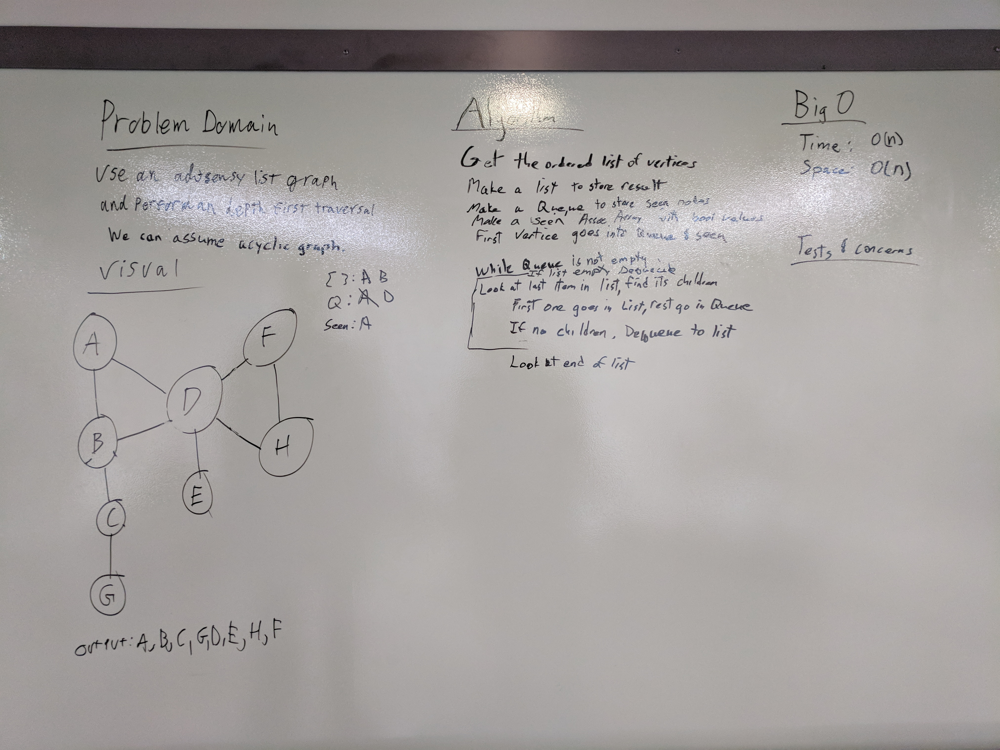

# depth_first

Conduct a depth first preorder traversal on a acyclic graph

## Challenge

Create a function that accepts an adjacency list as a graph, and conducts a depth first traversal. Without utilizing any of the built-in methods available to your language, return a collection of nodes in their depth first traversal order

## Solution

**Author**: Chris L Chapman
**Whiteboard Contributors** Nick Damberg, Chris L Chapman
