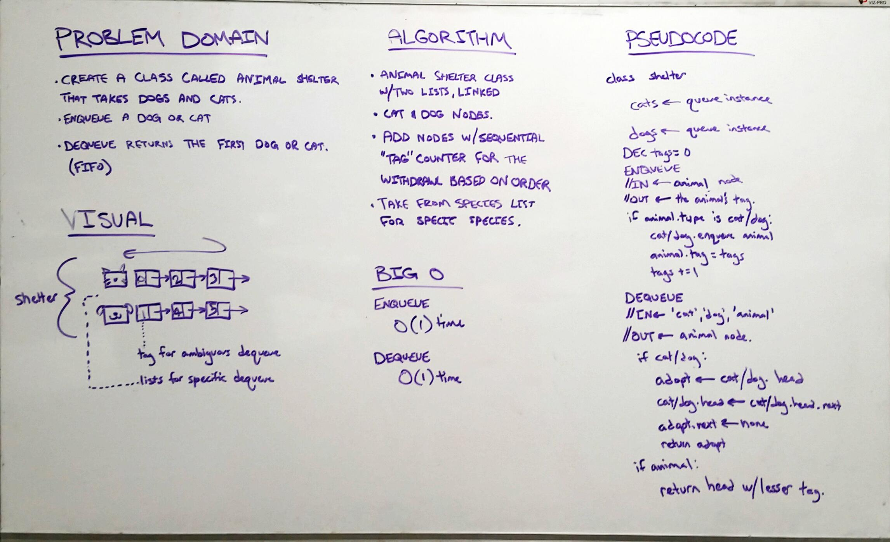

# fifo_animal_shelter

First-in, First out Animal Shelter.

## Challenge

Create a class called AnimalShelter which holds only dogs and cats. The shelter operates using a first-in, first-out approach. Implement the following methods:

- enqueue(animal): adds animal to the shelter. animal can be either a dog or a cat object.

- dequeue(pref): returns either a dog or a cat. If pref, a string, is ‘cat’ return the longest-waiting cat. If pref is ‘dog’, return the longest-waiting dog. For anything else, return either a cat or a dog.

- Stretch Goal: If a cat or dog isn’t preferred, return whichever animal has been waiting in the shelter the longest.

## Solution

**Author**: Chris L Chapman
**Whiteboard Contributors**  Jason Burns, Michael Sklepowich
