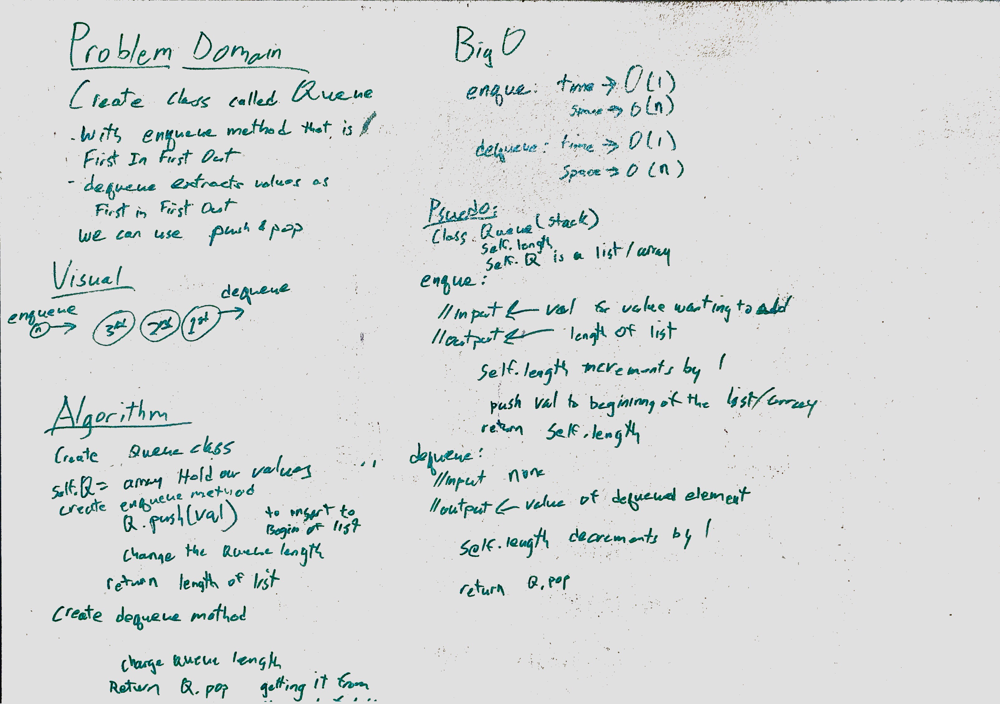

# queue_with_stacks

Implement a Queue using two Stacks.

## Challenge

enqueue(value) which inserts value into the Queue using a first-in, first-out approach.
dequeue() which extracts a value from the Queue using a first-in, first-out approach.
        You have access to 2 Stack instances with push and pop methods.

## Solution

**Author**: Chris L Chapman
**Whiteboard Contributors**  J Christie
