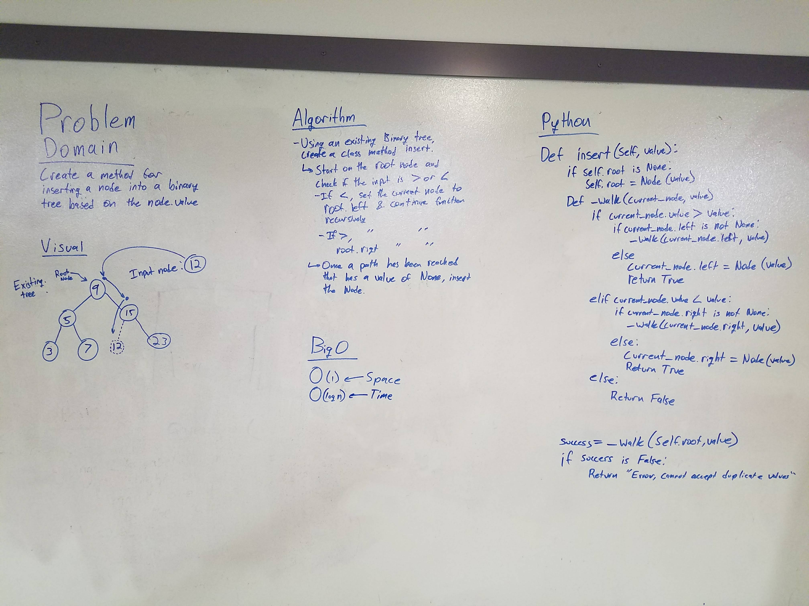

# binary_search_tree

This is an implementation of a Binary Tree.
It is not self-correcting.
While somewhat close, this is not a Binary Search Tree.

## Challenge

In bst.py:
Create a Class for a Node which is aware of the value as val and left and right children as left and right respectively
Ensure that you have a __repr__ and __str__ method defined to return appropriate representations of the node
Create a Class for a BST, which is aware of the root of the tree as root
Ensure that you have a __repr__ and __str__ method defined to return appropriate representations of the tree
This class should accept an iterable as an argument when initialized, such as [20, 18, 12, 19, 11, 14, 40, 31, 22, 33], which creates a tree from that argument
This class should be aware of depth-first traversal methods for in_order, pre_order, and post_order traversals
This class should have the ability to insert a new node into the tree. Your insertion should follow an O(log n) search solution to find the correct place for inserting the new node.

## Solution

**Author**: Chris L Chapman
**Whiteboard Contributors** Max McFarland
