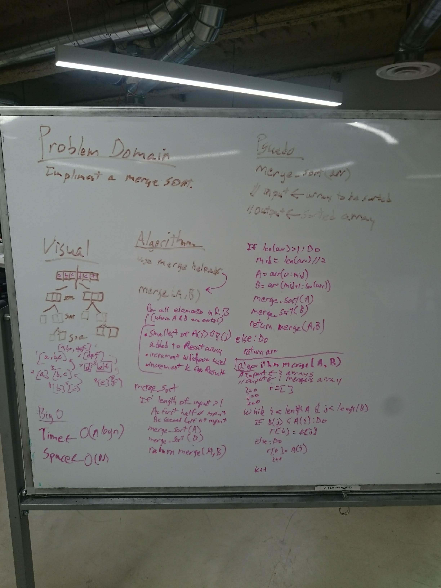

# Sorting Algorithms

## selection_sort

 Sorts an array by repeatedly finding the minimum element (considering ascending order) from unsorted part and putting it at the beginning. The algorithm maintains two subarrays in a given array.

## merge_sort

Write a function that accepts an array of unsorted integers, and returns a sorted array by a recursive mergesort algorithm.

## quick_sort

chooses a pivot, then places all values lower than the pivot value before the pivot index, and all values greater than the pivot after the pivot. This is done recursively for all sub-sets of the array to ensure the full array is sorted in acsending order.

## radix_sort

Digit by digit sort starting from least significant digit to most significant digit.

<!-- ## name_sort -->

<!-- description -->

<!--  -->

<!-- ## name_sort -->

<!-- description -->

<!--  -->

**Author**: Chris L Chapman
**Whiteboard Contributors** Chris L Chapman
