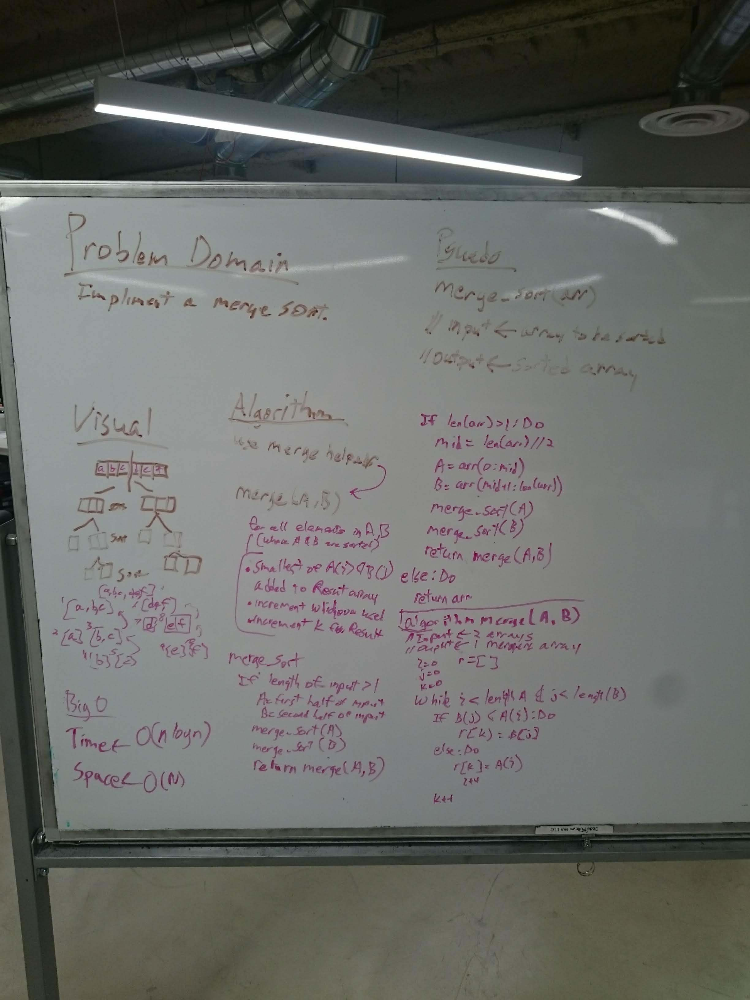

# mergesort

Implement Mergesort.

## Challenge

Write a function that accepts an array of unsorted integers, and returns a sorted array by a recursive mergesort algorithm.

## Solution

**Author**: Chris L Chapman
**Whiteboard Contributors** Chris L Chapman
